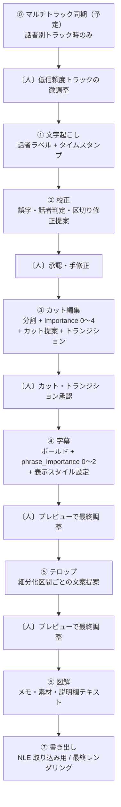

# AI簡易動画編集 — Yuru-Style Video Editor

対話形式動画（対談・インタビュー・ポッドキャスト映像など）向けの **AI 駆動・半自動編集デスクトップアプリ** です。  
文字起こしから始め、AI が編集判断を提案し、人間が承認・調整しながら進めます。最終的には Adobe Premiere / DaVinci Resolve 等で **追加編集・調整可能な形式** として書き出すほか、**本ツール内での最終レンダリング出力** も可能です。

> **開発状況（2026年6月時点）**  
> ① 文字起こし・② 校正まで実装済み。③ カット編集は Part 分割 UI まで実装済み（Importance 判定・カット提案・トランジション挿入は予定）。⓪ マルチトラック同期・④ 以降は設計済みで順次追加予定。

---

## 背景

「ゆる言語学ラジオ」「ゆるコンピュータ科学ラジオ」をはじめとする"ゆる系"の対談・トーク動画群は、テロップ・字幕の表示編集が驚くほど洗練されている。重要度に応じた強調、話者ごとの配置、リアクションへの装飾——これらは量産を前提とした制作体制であるがゆえに、かなり形式的、つまりルールベースで再現可能な範囲に落とし込まれている。
それでも、その形式化された編集は視聴者の理解を大きく助けている。むしろ型として磨き込まれているからこそ、内容に集中しながら見られる完成度になっている。
この洗練されたテロップ表現が、他の対談動画やインタビュー動画にも当たり前に存在したら面白いのではないか——そう考えたのが本プロジェクトの出発点である。ルールベースで再現可能ということは、AIによる自動化との相性が良いということでもある。トランスクリプション、重要度判定、テロップ生成、場面転換といった一連の編集プロセスをAI駆動のワークフローに落とし込めるはずだと考え、本ツールの開発に着手した。

---

## 機能概要

各ステップの後に人間の確認・承認があり、④ 字幕・⑤ テロップではプレビューを見ながら手動で最終調整します。



| フェーズ | 内容 | 状態 |
|---|---|---|
| ⓪ | 動画と話者別音声トラックのオフセット同期（混合音声のみの場合はスキップ） | 予定 |
| ① | 動画の文字起こし、話者分離、話者ラベル設定 | **実装済み** |
| ② | 誤字・話者判定・区切りの AI 校正提案と承認 | **実装済み** |
| ③ | Part 分割、重要度判定、カット提案、トランジション挿入 | 一部実装済み |
| ④ | 字幕の強調・表示スタイル設定とプレビュー調整 | 予定 |
| ⑤ | テロップ文案の AI 提案とプレビュー調整 | 予定 |
| ⑥ | 図解・引用・訂正メモ、説明欄テキストの生成 | 予定 |
| ⑦ | NLE 向け書き出し、最終レンダリング | 予定 |

---

## スクリーンショット

### 完成イメージ（参考）

<p align="center">
  
  
  
</p>

### 実装済み

<p align="center">
  
  
</p>
<p align="center"><em>① 文字起こし — 動画選択・実行</em></p>

<p align="center">
  
</p>
<p align="center"><em>① 文字起こし — 話者ラベル設定</em></p>

<p align="center">
  
</p>
<p align="center"><em>② 校正 — トランスクリプト確認と校正候補の承認</em></p>

<p align="center">
  
</p>
<p align="center"><em>③ カット編集 — Part 分割（一部実装済み）</em></p>

<p align="center">
  
</p>
<p align="center"><em>AI API 設定（Claude / OpenAI / Gemini）</em></p>

### 予定

<p align="center">
  
  
</p>
<p align="center"><em>③ カット編集 — 重要度判定・トランジション挿入</em></p>

<p align="center">
  
  
</p>
<p align="center"><em>④ 字幕・⑤ テロップ</em></p>

<p align="center">
  
  
</p>
<p align="center"><em>⑥ 図解・⑦ 書き出し</em></p>

---

## 各フェーズの詳細

### ⓪ マルチトラック同期（予定）

ピンマイク等で **動画 + 話者別音声** を別ファイルで取り込む場合、文字起こしの前にオフセットを合わせます。動画内の混合音声のみの場合はこのステップをスキップします。

### ① 文字起こし

動画から単語単位の文字起こしを生成し、タイムスタンプと話者 ID を付与します。Whisper による書き起こしと話者分離（NVIDIA NeMo MSDD）に対応。話者の表示名・画面上の位置・識別色を設定できます。

### ② 校正

AI が誤字・聞き間違い、話者の割り当てミス、発話の区切り誤りなどを検出し、提案を提示します。各提案を承認・却下し、必要に応じて手動で修正します。

### ③ カット編集

トランスクリプトを意味的な区間（本筋・脱線・リアクション等）に分割し、各区間の重要度（0〜4）に基づいてカット提案やトランジション挿入を行います。Part 境界のドラッグ調整や種別変更に対応（分割 UI は実装済み）。

### ④ 字幕（予定）

残ったトランスクリプトから強調するフレーズを抽出し、重要度に応じた字幕スタイルを設定。プレビュー上で最終調整します。

### ⑤ テロップ（予定）

トランスクリプトを細かい区間に分割し、各区間のテロップ文案を AI が提案。プレビュー上で文案・位置・表示時間を調整します。

### ⑥ 図解（予定）

特定の発話箇所について、図解・注釈・引用・訂正をタイムスタンプ付きメモとして提案します。動画の説明欄用テキストも生成します（動画への反映は外部 NLE で行います）。

### ⑦ 書き出し（予定）

編集結果を NLE 取り込み用形式で出力するほか、本ツール内での最終レンダリングも可能です。

| 出力物 | 内容 |
|---|---|
| `timeline.fcpxml` | NLE 取り込み用タイムライン |
| `subtitles/` | 字幕ファイル（.srt / .ass / .vtt） |
| `media_hints.json` | 図解・引用メモ |
| `description.txt` | 動画説明欄用テキスト |
| `project_data.json` | 再編集用マスターデータ |
| `rendered/` | 最終レンダリング動画（任意） |

推奨 NLE: DaVinci Resolve / Adobe Premiere Pro / Final Cut Pro

---

## 技術スタック

| レイヤー | 技術 |
|---|---|
| デスクトップ | Tauri v2（Rust + WebView2） |
| UI | React 18 + TypeScript + Tailwind CSS |
| 文字起こし | Whisper + NVIDIA NeMo MSDD（ローカル Python） |
| AI 編集支援 | Claude / OpenAI / Gemini |
| タイムライン | wavesurfer.js |
| 出力 | FCPXML / ASS・SRT・VTT |

---

## セットアップ

```bash
npm install
npm run tauri:dev    # 開発用起動
npm run tauri:build  # ビルド
```

**前提環境**: Node.js 18+、Rust、Python 3.10+、ffmpeg、NVIDIA GPU（推奨）

---

## プライバシー

- **文字起こし・話者分離**: ローカル処理（クラウド送信なし）
- **AI 校正以降（②〜⑥）**: 登録した API キーで各社 API にトランスクリプト断片を送信
- **API キー**: 端末の localStorage にのみ保存

---

## ドキュメント

設計仕様・データモデル・詳細な技術資料は [`docs/`](docs/README.md) を参照してください。

| ドキュメント | 内容 |
|---|---|
| [docs/README.md](docs/README.md) | 設計仕様書 |
| [docs/DATAMODEL.md](docs/DATAMODEL.md) | データモデル |
| [docs/SYNC.md](docs/SYNC.md) | マルチトラック同期設計 |
| [docs/EXPORT.md](docs/EXPORT.md) | 出力フォーマット |
| [design.md](design.md) | UI デザインシステム |

---

## ライセンス

（リポジトリの LICENSE に従います。未設定の場合はプロジェクトオーナーへお問い合わせください。）
