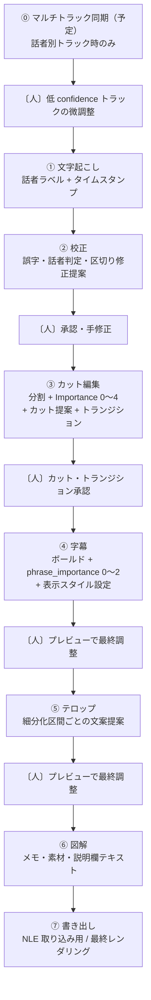
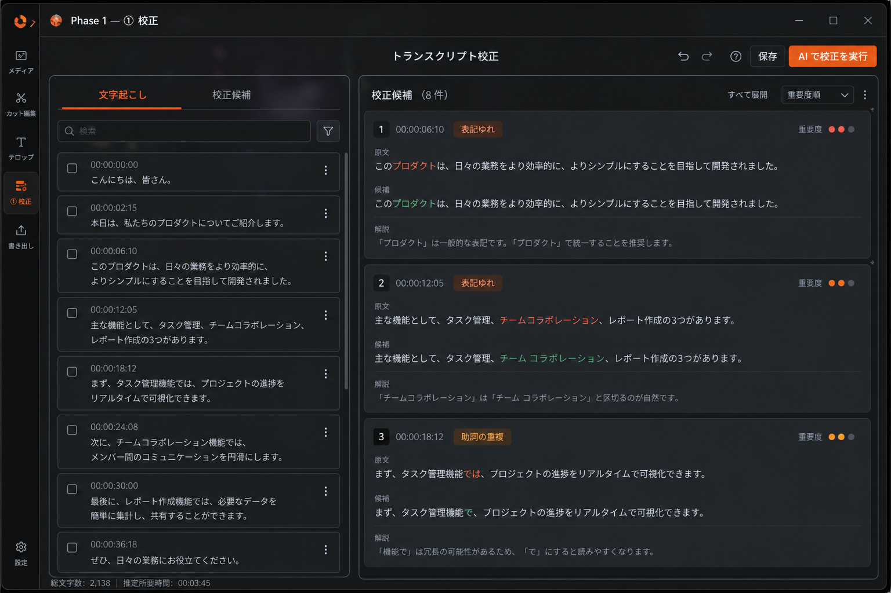
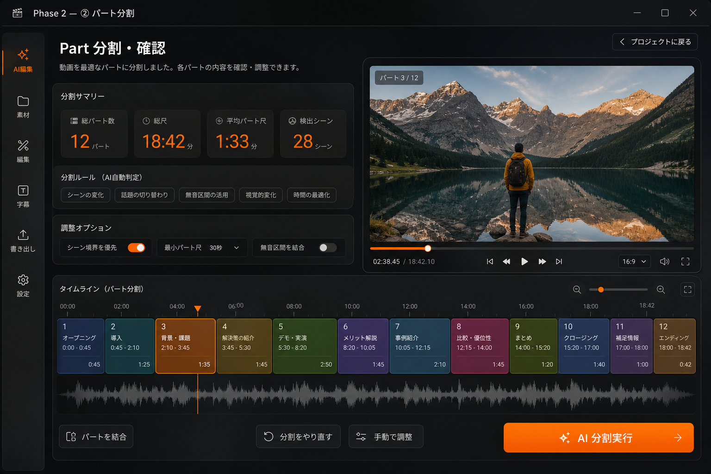
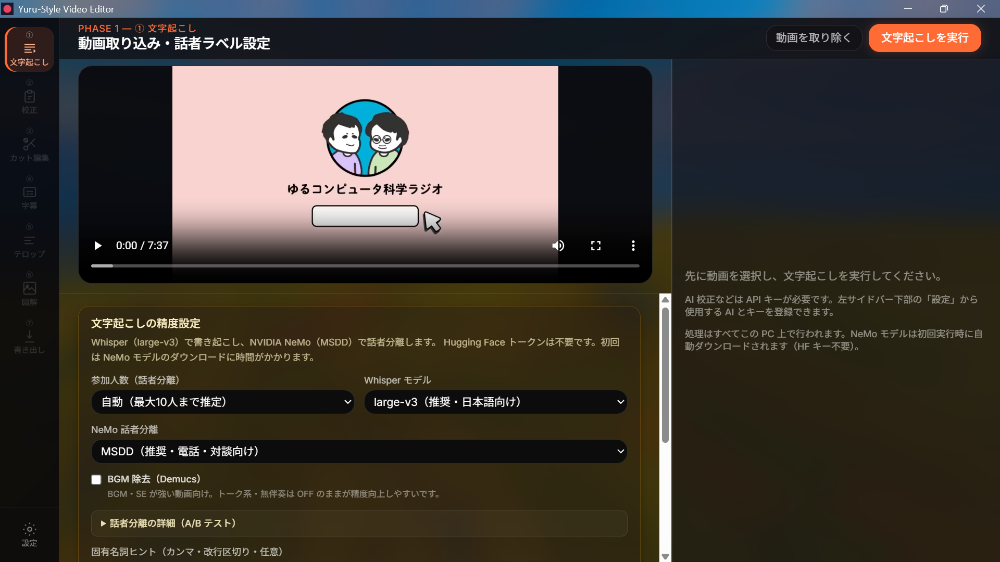
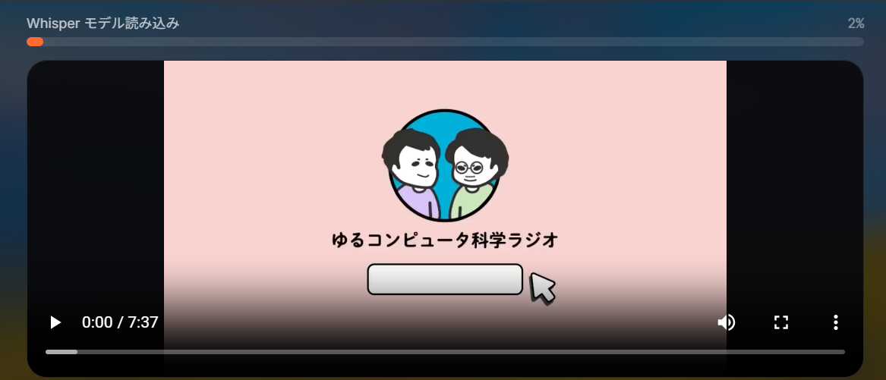
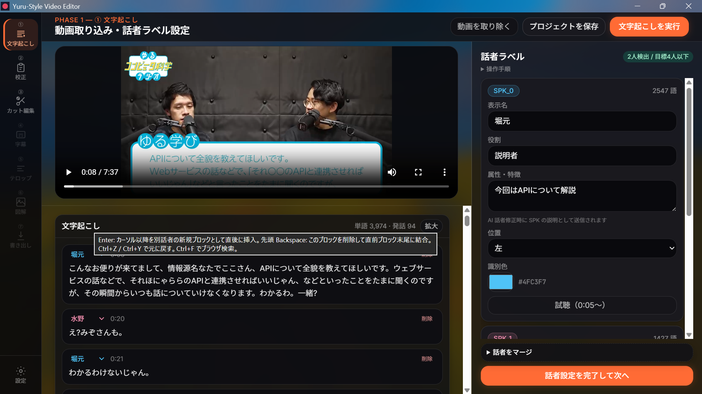
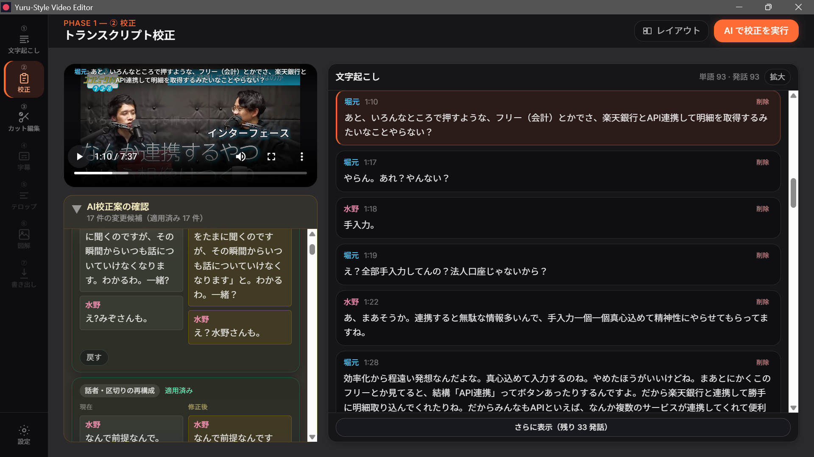
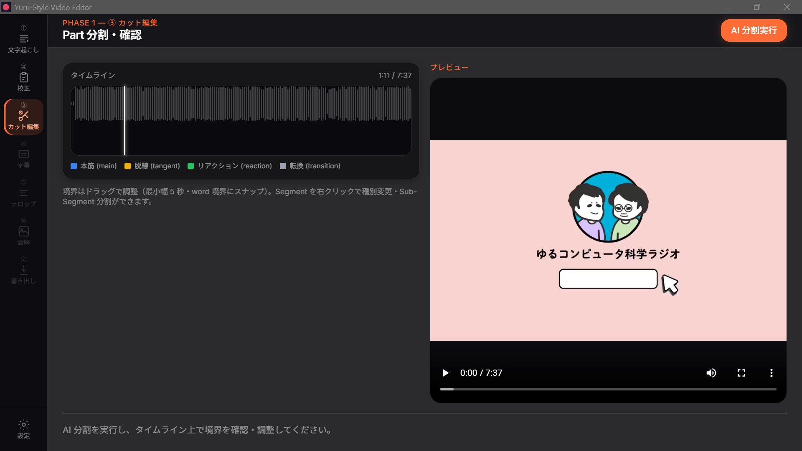
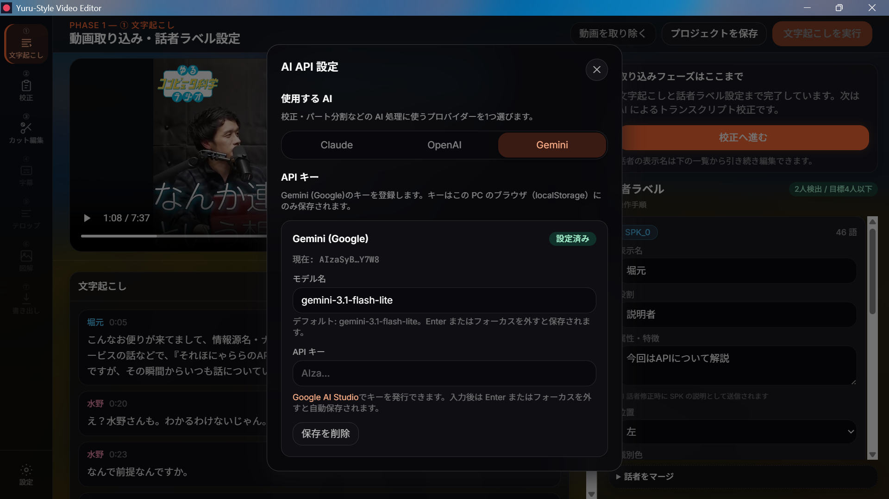

# AI簡易動画編集 — Yuru-Style Video Editor

対話形式動画（対談・インタビュー・ポッドキャスト映像など）向けの **AI 駆動・半自動編集デスクトップアプリ** です。  
文字起こしから始め、AI が編集判断を提案し、人間が承認・調整しながら進めます。最終的には Adobe Premiere / DaVinci Resolve 等で **追加編集・調整可能な形式** として書き出すほか、**本ツール内での最終レンダリング出力** も可能です。

> **開発状況（2026年6月時点）**  
> ① 文字起こし・② 校正まで UI 実装済み。③ カット編集は Part 分割 UI まで実装済み（Importance 判定・カット提案・トランジション挿入は予定）。⓪ マルチトラック同期（複数マイク撮影対応）は設計済み・実装予定。④ 以降は設計済みで順次追加予定。  
> 内部設計の詳細は [`docs/`](docs/README.md) を参照してください。

---

## 開発の経緯

「ゆる言語学ラジオ」「ゆるコンピュータ科学ラジオ」をはじめとする"ゆる系"の対談・トーク動画群は、テロップ・字幕の表示編集が洗練されています。重要度に応じた強調、話者ごとの配置、適度な注釈とテロップ、これらは量産を前提とした制作体制であるがゆえにかなり定型的、つまり半ルールベースで再現可能な範囲に落とし込まれています。それでも、その形式化された編集は視聴者の理解を大きく助けており、型として磨き込まれているからこそ内容に集中しながら見られる完成度になっています。この洗練されたテロップ表現が他の対談動画やインタビュー動画にも当たり前に存在したら面白いのではないか、そう考えたのが本プロジェクトの出発点です。ルールベースで再現可能ということは、AIによる自動化との相性が良いということでもあります。トランスクリプション、重要度判定、テロップ生成、場面転換といった一連の編集プロセスをAI駆動のワークフローに落とし込めるはずだと考え、本ツールの開発に着手しました。

---

## 編集ワークフロー（全体像）

以下が本ツールの **中核となる処理の流れ** です。各ステップの後に人間の確認・承認があり、④ 字幕・⑤ テロップではプレビューを見ながら手動で最終調整します。

> **⓪ マルチトラック同期（予定）**  
> ピンマイク等で **動画 + 話者別音声 N 本** を取り込む場合のみ、① の前にオフセット合わせを行う。単一の混合音声（動画内マイクのみ等）の場合はスキップして ① へ直接進む。詳細は [docs/SYNC.md](docs/SYNC.md)。

```
⓪ マルチトラック同期（予定・話者別トラック入力時のみ）
   ・動画と各話者音声のオフセット算出（FFT 相関 / メタデータフォールバック）
   ・confidence 低いトラックは波形を見ながら人手微調整
        ↓
① 文字起こし（話者ラベルとタイムスタンプ付き）
   ※話者別トラック時: 統合ミックスで書き起こし、RMS 最大トラックで話者判定
        ↓
② 校正
   （単純な校正 ＋ 話者判定・区切りの修正提案）
        ↓
〔人〕校正提案を承認、手動修正。
        ↓
③ カット編集
   ・本筋1 → 脱線1 → 本筋2 → 本筋3 → 脱線2 → … のような分割
   ・各セグメントの Importance を 5 段階（0〜4）で判定
     本筋: 4 または 3 / 雑談・脱線: 関連度・面白さ等で 0〜2
   ・Importance 基準でカット提案
   ・トランジション動画挿入の提案
   ※カットとトランジション挿入でセリフのタイムスタンプが変化する
        ↓
〔人〕カット・トランジション提案を承認しタイミング調整
        ↓
④ 字幕
   ・残ったトランスクリプションの重要セリフ・文言をボールド化
   ・phrase_importance を 3 段階（0〜2）で判定
     重要フレーズ・セリフ=2 / 大きめの返事・反応=0〜1
   ・Importance ごとの字幕の出し方を設定
        ↓
⑤ テロップ
   ・トランスクリプトをより細かな区間に細分化
   ・各区間についてテロップ文案を AI が提案
        ↓
〔人〕AI提案をプレビュー表示しながら字幕とテロップの最終調整
        ↓
⑥ 図解
   ・特定箇所について図解・注釈・引用表示・訂正などを提案
   ・タイムスタンプ付きメモとして出力（Mermaid / 画像生成も検討）
   ・動画の説明欄用テキストも生成
   ※実際の動画への反映は外部 NLE で行う（メモ・素材として出力）
        ↓
⑦ 書き出し
   ・Adobe / DaVinci 等で追加編集・調整可能な形式を維持しての出力
   ・本ツール内での最終レンダリング出力も可能に
```



| フェーズ | 状態 |
|---|---|
| ⓪ | **予定**（複数マイク・話者別トラック同期。設計は [docs/SYNC.md](docs/SYNC.md)） |
| ① ② | **実装済み** |
| ③ | **一部実装済み**（Part 分割 UI まで。Importance・カット提案・トランジションは予定） |
| ④ ⑤ ⑥ ⑦ | 予定 |

---

## ゴール像（完成時の UI イメージ）

以下は **参考イメージ** です（実画面のキャプチャではありません）。

<p align="center">
  
  
  
</p>

---

## 各フェーズの詳細

### ⓪ マルチトラック同期 — 予定

実務向けの **ピンマイク・複数レコーダー撮影** に対応する前処理ステップ。① 文字起こしの直前に位置する。

| 入力モード | 内容 | 本ステップ |
|---|---|---|
| 混合音声 | 動画 1 本（内蔵マイク等） | スキップ → ① へ |
| 話者別トラック | 動画 1 本 + 話者用音声 N 本 | オフセット同期 → ① へ |

| 処理 | 内容 |
|---|---|
| オフセット算出 | 動画音声と各話者トラックの FFT クロスコリレーション（2 段階: 8 kHz 粗探索 → 原サンプルレートで精密化） |
| フォールバック | 動画に音声がない場合は ffprobe の `creation_time` 差分で粗オフセット（confidence ≈ 0.3） |
| 人手確認 | confidence < 0.6 のトラックのみ波形オーバーレイ + ±ms 微調整 UI |
| ① への引き渡し | 同期済みトラックを統合して文字起こし。話者分離は **RMS エネルギー最大トラック** で判定 |

**出力**: `meta.audio_sources`（`offset_ms`, `sync_confidence` 付きトラック定義）

設計詳細: [docs/SYNC.md](docs/SYNC.md)

---

### ① 文字起こし — 実装済み

動画から **word 単位** の文字起こしを生成し、各単語に `start_ms` / `end_ms`（タイムスタンプ）と話者 ID を付与します。

| 処理 | 内容 |
|---|---|
| 動画取り込み | 元動画をプロジェクトに紐づけ（話者別トラックも任意で追加 — ⓪ 予定） |
| 文字起こし | Whisper（large-v3）で書き起こし |
| 話者分離 | 混合音声: NVIDIA NeMo MSDD / 話者別トラック（⓪ 後・予定）: RMS エネルギー最大トラック |
| 話者整理 | 誤分割のマージ、表示名・画面上の位置（左/右/中央）・識別色 |
| 手動修正 | トランスクリプトの直接編集、話者分離の AI 見直し（任意） |

**出力**: `words[]`（タイムスタンプ付き）, `meta.speakers[]`

<p align="center">
  
  <br /><em>① 動画選択・文字起こし準備</em>
</p>

<p align="center">
  
  <br /><em>① 文字起こし実行中</em>
</p>

<p align="center">
  
  <br /><em>① 話者ラベル設定</em>
</p>

---

### ② 校正 — 実装済み

文字起こし結果に対する **校正と構造修正の提案** を AI が行い、人間が承認します。

**検出・指摘の対象**

| 種別 | 内容 |
|---|---|
| テキスト校正 | 誤字・脱字、聞き間違い（`typo` / `mishearing`） |
| 会話内容 | 文脈上不自然な発話、事実誤認の可能性（`fact_error`） |
| 話者判定 | 話者の割り当てミス |
| 区切り | 発話・文の区切りの誤り |

**人間の操作フロー**

1. トランスクリプトを目視確認（手動編集可）
2. AI 校正を実行
3. 各提案を **承認** または **却下**（承認した内容はトランスクリプトに反映）

**出力**: `words[]`（校正後のテキスト・タイムスタンプ・話者 ID）

<p align="center">
  
  <br /><em>② 校正画面</em>
</p>

---

### ③ カット編集 — 一部実装済み

トランスクリプトを **意味的な区間（Part）** に分割し、Importance 判定・カット提案・トランジション挿入までを一括で行います。

**例**: `本筋1` → `脱線1` → `本筋2` → `本筋3` → `脱線2` → …

| Part 種別 | 意味 |
|---|---|
| `main` | 動画の本筋・テーマに直結 |
| `tangent` | 脱線・余談・雑談 |
| `reaction` | 相槌・笑い・驚きなど短いリアクション |
| `transition` | 話題転換の橋渡し |

**Importance（5 段階: 0〜4）**

| 対象 | スコアの目安 |
|---|---|
| 本筋（`main`） | **4** = 絶対に残す / **3** = 重要 |
| 雑談・脱線（`tangent` 等） | **2** = 面白い・関連性あり / **1** = どちらでも / **0** = 除去候補 |

AI が `importance_reason`（根拠）を併記し、Importance 基準で **カット（trim）提案** を提示します。話題転換が激しい Part 境界には **トランジション動画挿入** も提案します（ソフトウェアエフェクトまたは動画クリップ素材）。

> **実装上の注意**: カットとトランジション挿入によってセリフのタイムスタンプが変化します。③ 完了後は `edited_timeline_ms` 等で編集後タイムライン上の位置を再計算し、④ 以降のフェーズは編集後タイムスタンプを基準に処理します。

**人間の操作**

- Part 境界のドラッグ調整（最小幅 5 秒・word 境界スナップ）、種別変更、Sub-Part 分割
- カット提案の **承認** / 却下、除去タイミングの微調整
- トランジション種別・長さ・素材の調整

**出力**: `parts[]`（`part_importance`, `trim`, `scene_transition`）, `scene_transitions[]`, 編集後タイムライン

<p align="center">
  
  <br /><em>③ Part 分割タイムライン</em>
</p>

<p align="center">
  
  <br /><em>③ Importance 判定・カット提案</em>
</p>

<p align="center">
  
  <br /><em>③ トランジション挿入提案</em>
</p>

---

### ④ 字幕 — 予定

③ で残ったトランスクリプトから、字幕上で目立たせる箇所を抽出し、表示スタイルを設定します。

| phrase_importance | 対象例 |
|---|---|
| **2** | 重要フレーズ・聞き逃せないセリフ |
| **1** | やや強調したいフレーズ |
| **0** | 大きめの返事・リアクション、通常表示 |

phrase_importance ごとに字幕の出し方（フォント・サイズ・表示位置・滞留時間など）を `style_config.json` で設定し、**プレビューに重ねながら手動で最終調整** します。

**出力**: `phrases[]`（`bold`, `phrase_importance`）, `style_config.json` の字幕スタイル

<p align="center">
  
  <br /><em>④ 字幕プレビュー＋ボールド強調</em>
</p>

---

### ⑤ テロップ — 予定

トランスクリプトを **Part より細かい区間** に細分化し、各区間について視聴者が「今何の話か」を一目でわかる **テロップ文案**（20 文字以内目安）を AI が提案します。

**人間の操作**: テロップをプレビューに重ねて表示し、文案・位置・表示時間を手動調整。

**出力**: `telop_segments[]`（細分化区間ごとのテロップ文案・表示タイミング）

<p align="center">
  
  <br /><em>⑤ テロッププレビュー</em>
</p>

---

### ⑥ 図解 — 予定

特定の発話箇所について、理解を深める **図解・注釈・引用表示・訂正** をタイムスタンプ付きメモとして提案します。Mermaid 出力や画像生成も検討します。

| 提案種別 | 例 |
|---|---|
| 図解（figure） | 概念を視覚化するイラスト・図（Mermaid 等） |
| 説明（explanation） | 補足テキスト・注釈 |
| 引用（citation） | 出典・参考文献 |
| 訂正（correction_note） | fact_error 等の注記 |

**動画の説明欄用テキスト** もここで生成します。

> **設計方針**: 実際の動画への反映は外部 NLE（Adobe / DaVinci 等）で行います。本ツールは **メモ・素材として出力** するのみです。

**出力**: `media_hints[]`, `description_text`（説明欄文案）, 図解素材（Mermaid / 画像）

<p align="center">
  
  <br /><em>⑥ 図解・引用・説明欄テキスト</em>
</p>

---

### ⑦ 書き出し — 予定

ここまでの編集結果を、**Adobe / DaVinci 等で追加編集・調整可能な形式** として書き出すほか、**本ツール内での最終レンダリング**（動画の焼き込み出力）も可能です。

| 出力物 | 内容 |
|---|---|
| `timeline.fcpxml` | NLE 取り込み用タイムライン（カット構造・字幕・テロップ・トランジション） |
| `subtitles/` | `.srt` / `.ass` / `.vtt` |
| `media_hints.json` | 図解・引用メモ（NLE マーカーにも埋め込み） |
| `description.txt` | 動画説明欄用テキスト |
| `project_data.json` | 再編集用マスターデータ |
| `rendered/` | 最終レンダリング動画（任意・焼き込み出力） |

**推奨 NLE**: DaVinci Resolve / Adobe Premiere Pro / Final Cut Pro

<p align="center">
  
  <br /><em>⑦ 書き出し画面</em>
</p>

---

## 共通 UI — 実装済み

### AI API 設定

Claude / OpenAI / Gemini からプロバイダを選び、API キーを登録します。キーは端末の localStorage にのみ保存されます。

<p align="center">
  
  <br /><em>AI API 設定</em>
</p>

---

## 最終成果物（⑦ 書き出し）

⑦ 書き出しで、外部 NLE へ渡す `output/` フォルダを生成します。NLE で追加編集・調整可能な形式での出力に加え、最終レンダリング出力も可能です。

| 復元される情報 | 内容 |
|---|---|
| カット構造 | 除去（trim）後のクリップ列＋トランジション |
| 字幕 | 話者別・phrase_importance 別スタイル |
| テロップ | 細分化区間ごとの文案 |
| マーカー | 図解・引用メモ、fact_error 注記 |
| 説明欄テキスト | `description.txt` |

```
output/
├── timeline.fcpxml          ★ NLE 取り込みのエントリ
├── assets/                  クリップ・トランジション素材
├── subtitles/               .srt / .ass / .vtt
├── design_reference/        テロップ参照 PSD
├── media_hints.json         図解・引用メモ
├── description.txt          動画説明欄用テキスト
├── project_data.json        再編集用マスター
└── rendered/                最終レンダリング動画（任意）
```

---

## 技術概要

| レイヤー | 技術 |
|---|---|
| デスクトップシェル | Tauri v2（Rust + WebView2） |
| UI | React 18 + TypeScript + Tailwind CSS（Glassmorphism） |
| 文字起こし | Whisper + NVIDIA NeMo MSDD（ローカル Python） |
| AI 編集支援 | Claude / OpenAI / Gemini |
| タイムライン | wavesurfer.js + 自作 Part ブロック |
| 出力（⑦） | FCPXML / ASS・SRT・VTT / メモ・素材 / 最終レンダリング動画 |

---

## セットアップ・起動

```bash
npm install
npm run tauri:dev    # デスクトップ版（文字起こし・動画選択に必須）
npm run tauri:build  # ビルド
```

**前提**: Node.js 18+、Rust、Python 3.10+、ffmpeg、NVIDIA GPU（推奨）

---

## プライバシー

- **文字起こし・話者分離**: ローカル処理（クラウド送信なし）
- **AI 校正以降（②〜⑥）**: 登録 API キーで各社 API にトランスクリプト断片を送信
- **API キー**: 端末の localStorage のみ

---

## 今後のプラン: 複数マイク撮影対応（⓪ マルチトラック同期）

実務の対談・インタビュー撮影では、カメラ映像と話者ごとのピンマイク録音が別ファイルになることが多い。これに対応するため、① 文字起こしの前段に **⓪ マルチトラック同期** を追加する予定である。

**想定入力**

- 映像: 動画 1 本
- 音声: 話者1用・話者2用・…・その他 など、話者別トラック N 本

**処理の要点**

1. **同期（⓪）**: 動画タイムライン基準に各話者トラックのオフセットを合わせる（FFT 相関 + 低信頼度時の人手微調整）
2. **文字起こし（①）**: 同期済み話者トラックを統合したミックスから Whisper で書き起こし
3. **話者分離（①）**: クラスタリングではなく、各時刻で **RMS エネルギーが最大の話者トラック** を話者 ID とする（ピンマイク分離を直接利用）

単一の混合音声ファイルのみの場合は ⓪ をスキップし、現行どおり ① へ進む。

---

## 関連ドキュメント

| ドキュメント | 内容 |
|---|---|
| [docs/README.md](docs/README.md) | 設計仕様書 |
| [docs/DATAMODEL.md](docs/DATAMODEL.md) | データモデル |
| [docs/SYNC.md](docs/SYNC.md) | ⓪ マルチトラック同期設計（予定） |
| [docs/AI_PROMPTS.md](docs/AI_PROMPTS.md) | AI プロンプト設計 |
| [docs/PREVIEW.md](docs/PREVIEW.md) | プレビューエンジン設計 |
| [docs/EXPORT.md](docs/EXPORT.md) | 出力フォーマット |
| [design.md](design.md) | UI デザインシステム |

---

## ライセンス

（リポジトリの LICENSE に従います。未設定の場合はプロジェクトオーナーへお問い合わせください。）
